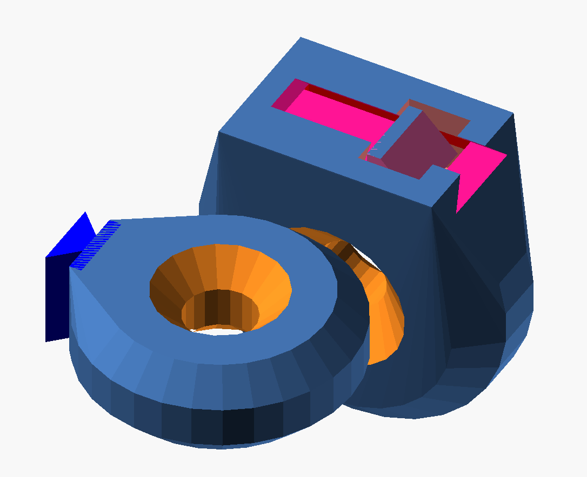

# slide-n-snap

Use these openscad modules can be used to attach two FDM 3D printed parts rigidly together with no additional hardware. Parts can be attached in such away that separating them is very difficult. Male and female parts should be printed in their given orientations to maximize the tensile strength of the connection. The two parts slide and snap together. A living spring and hook snap and lock the pieces in place when they are assembled.

Usage: 
```
//Copy this file to the same directory where your openSCAD files are and use an include statement:
include<slide-n-snap.scad>;

//Subtract the slide_n_snap_female_clip_negative from one part. For example:
difference() {
  your_module(...);
  slide_n_snap_female_clip_negative(t=1.75,w=5.25,g=0.25,j=0.5,l=7,h=1,s=0.8,a=7,c=20);
}

//Also union the slide_n_snap male_clip from another part. For example:
union() {
  your_other_modules(...);
  slide_n_snap_male_clip(t=1.75,w=5.25,l=7)
}
```



<a rel="license" href="http://creativecommons.org/licenses/by/4.0/"></a><br /><span xmlns:dct="http://purl.org/dc/terms/" property="dct:title">slide-n-snap</span> by <a xmlns:cc="http://creativecommons.org/ns#" href="https://github.com/benjamin-edward-morgan/slide-n-snap" property="cc:attributionName" rel="cc:attributionURL">Benjamin E Morgan</a> is licensed under a <a rel="license" href="http://creativecommons.org/licenses/by/4.0/">Creative Commons Attribution 4.0 International License</a>.