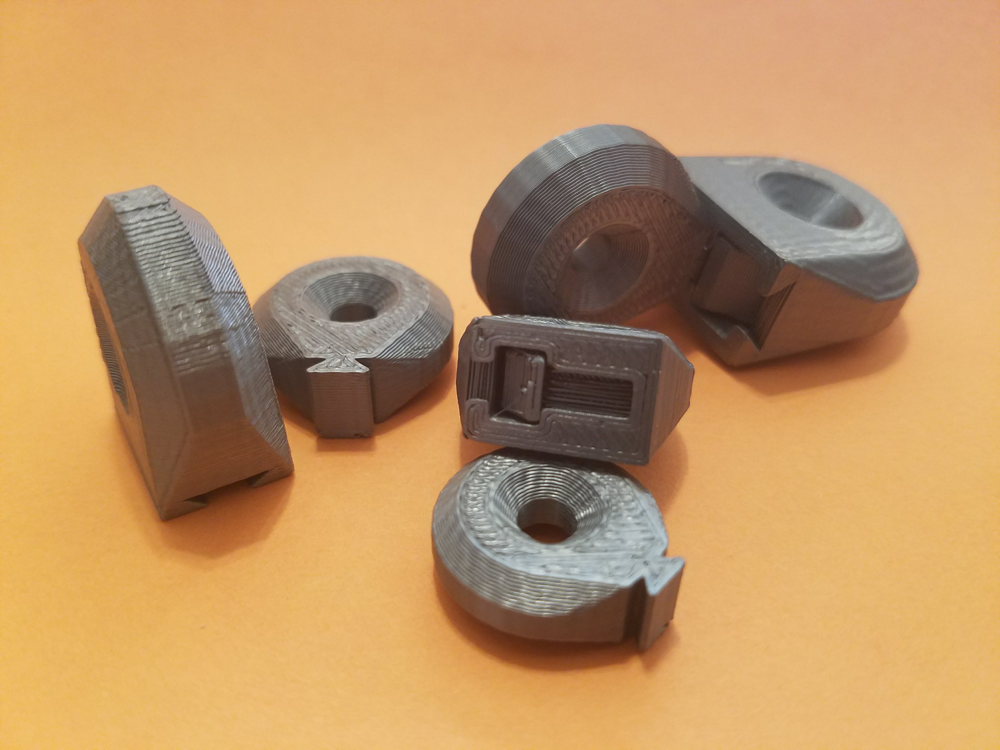
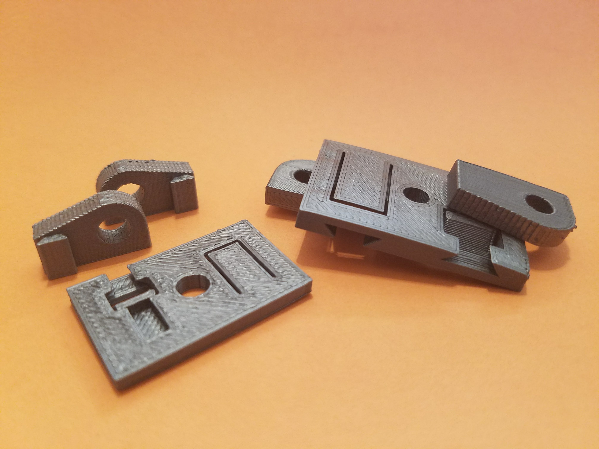

# slide-n-snap

Use these openSCAD modules to attach two FDM 3D printed parts together securely without requiring additional hardware.  The two parts, male and female, slide and snap together. They can attach so that separating them is difficult.

The female part's living spring and latch snaps and locks the male part in place when they are assembled. The female part is modeled in negative space and must be subtracted from one of the parts you wish to assemble. The male part of the connection is modeled in positive space and is added with the other part you are assembling. It is important to print the parts in their given orientations to maximize the tensile strength of the connection.

Usage:
```
//Copy slide-n-snap.scad to the same directory where your openSCAD files are and use an include statement:
include<slide-n-snap.scad>;

//Subtract the slide_n_snap_female_clip_negative from one part. For example:
difference() {
  your_module(...);
  slide_n_snap_female_clip_negative(t=1.75,w=5.25,g=0.25,j=0.5,l=7,h=1,s=0.8,a=7,c=20);
}

//Also union the slide_n_snap male_clip from another part. For example:
union() {
  your_other_module(...);
  slide_n_snap_male_clip(t=1.75,w=5.25,l=7)
}
```

# Test Parts

The `slide-n-snap-tests.scad` file utilizes this library and contains ring-shaped test parts to measure the fit and strength with different input parameters.

| Test Plate A | Test Plate B |
| --- | --- |
|  |  |
|  |  |


<a rel="license" href="http://creativecommons.org/licenses/by/4.0/"></a><br />
<span xmlns:dct="http://purl.org/dc/terms/" property="dct:title">slide-n-snap</span> by <a xmlns:cc="http://creativecommons.org/ns#" href="https://github.com/benjamin-edward-morgan/slide-n-snap" property="cc:attributionName" rel="cc:attributionURL">Benjamin E Morgan</a> is licensed under a <a rel="license" href="http://creativecommons.org/licenses/by/4.0/">Creative Commons Attribution 4.0 International License</a>.
